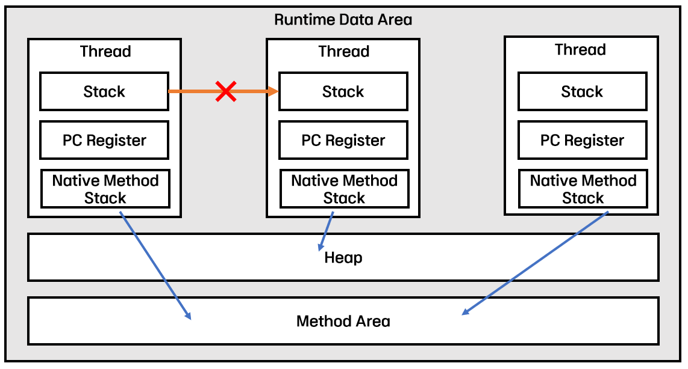

# Part01

## 3.1 람다란 무엇인가

자바에서는 동작 파라미터화를 통해 변화하는 요구사항에 유연하게 대응할 수 있으며,
정의한 코드 블록을 다른 메서드로 전달하는 방식으로 코드를 확장할 수 있다.
기존에는 익명 클래스를 사용해 다양한 동작을 구현할 수 있었지만, 
코드가 복잡하고 가독성이 떨어지는 단점이 있어 실전에서 동작 파라미터화를 적용하는 데 방해가 되었다.
이에 비해, 자바 8에서 도입된 람다 표현식은 익명 클래스처럼 이름이 없는 함수를 간결하게 표현할 수 있으며, 
메서드의 인수로 전달할 수 있다는 장점이 있어 더 깔끔하고 효율적으로 동작을 구현할 수 있다.

### 람다의 문법과 특징
람다는 이름이 없는 함수로, 특정 클래스에 종속되지 않아 **함수형 프로그래밍** 스타일을 지원한다.
**함수형 인터페이스**(하나의 추상 메서드만 갖는 인터페이스)를 기반으로 하며,
해당 인터페이스를 구현하는 방식으로 사용된다. 문법은 다음과 같다:

```
(파라미터 리스트) -> { 람다 바디 }       // 블록 스타일
```

혹은 return 문이 생략 가능한 경우엔 더 간결하게 쓸 수 있다:
```
(파라미터 리스트) -> 표현식            // 표현식 스타일
```

구체적으로는 다음과 같이 활용 가능하다:
```java
// 인자 두 개 받아 더하는 표현식
(int a, int b) -> a + b

// 인자 없이 42를 반환
() -> 42

// 표현식 스타일
// 문자열 길이 반환
// String 형식의 파라미터를 갖고,표현식의 값이 int형. int 값을 반환.
(String s) -> s.length()
    
//표현식 스타일
// 특정 조건 검사
//객체를 파리미터로 갖고, boolean 값을 반환한다. 
(Apple a) -> a.getWeight() > 150

// 블록 스타일
// 파라미터 리스트를 받아온다. 
// 블록이 반환값을 갖지 않으므로 void를 반환.
(int x, int y) -> {
    System.out.println("Sum:");
    System.out.println(x + y);
}
```
#### 익명 클래스 vs 람다식
익명 클래스와 비교했을 때, 람다는 훨씬 적은 코드로 동일한 동작을 구현할 수 있다. 
예를 들어 사과 목록을 무게순으로 정렬하는 경우, 기존에는 Comparator를 익명 클래스로 만들어야 했지만, 
Java 8에서는 다음처럼 한 줄로 표현할 수 있다:

```java
// 기존 익명 클래스 방식
Collections.sort(inventory, new Comparator<Apple>() {
    public int compare(Apple a1, Apple a2) {
        return a1.getWeight().compareTo(a2.getWeight());
    }
});

// 자바 8 람다 표현식
inventory.sort(Comparator.comparing(Apple::getWeight));

```
이처럼 람다는 간결성, 익명성, 전달 가능성이라는 세 가지 큰 장점을 가진다. 뿐만 아니라 외부 변수를 참조할 수 있는
**람다 캡처링(Lambda Capturing)** 이라는 특징도 있다.

#### 람다 캡처링 (Lambda Capturing)


람다 바디에서 참조하는 외부 변수를 **자유 변수(Free Variable)** 라고 하며,
이 자유 변수를 람다 안에서 참조하는 행위를 **람다 캡처링(Lambda Capturing)**이라고 한다.

자바에서 람다가 외부 변수를 사용할 수 있게 하려면 그 값이 고정되어 있어야 안전하다.
그래서 람다에서 지역 변수를 캡처하려면 해당 변수는 반드시 **final 또는 effectively final**이어야 한다.
즉, 한 번만 초기화되고 더 이상 변경되지 않는 값만 사용할 수 있다.

이는 자바가 람다 실행 시 해당 변수의 값을 복사해서 **힙(Heap)** 에 저장하기 때문이다.
원래 지역 변수는 스택에 저장되며 메서드 종료 시 사라지지만,
람다는 힙에 존재하는 객체이기 때문에 나중에 실행될 수 있고,
그 시점에도 변수 값을 안정적으로 참조해야 하므로 값을 복사해 보존한다.
복사된 변수는 더 이상 바꿀 수 없기 때문에, 변경 시 컴파일 에러가 발생한다.


```java
public void run() {
    final String localVar = "final";
    String anotherVar = "effectively final";

    Function<String, String> lambda1 = s -> s + " and " + localVar;
    Function<String, String> lambda2 = s -> s + " and " + anotherVar;
}
```

- localVar: 명시적 final이므로 캡처 가능
- anotherVar: 변경되지 않아서 effectively final → 캡처 가능
- anotherVar를 나중에 변경하면 컴파일 에러 발생. 

왜 마음대로 바꾸면 안 되는 지에 대해서 설명을 덧붙이자면, 

람다 내부에서 참조하는 지역 변수를 마음대로 바꾸게 되면,
언제 실행될지 모르는 람다가 예기치 않은 값을 참조할 수 있게 되어
일관성이 깨지거나 동기화 문제가 발생할 수 있다.

그래서 자바는 아예 “람다에서 참조하는 지역 변수는 절대 바꾸지 마” 라는 강제 규칙을 만든 것이다.

헷갈리지 말아야 하는 부분은 인스턴스 변수와 static 변수는 왜 캡처 제약이 없다. 


```java
public class Example {
    private String instanceVar = "instance";
    public static String staticVar = "static";

    public void run() {
        Function<String, String> lambda3 = s -> s + instanceVar;
        Function<String, String> lambda4 = s -> s + staticVar;
    }
}
```

- instanceVar는 인스턴스가 Heap에 존재하므로, 람다가 참조할 수 있다
- staticVar는 메서드 영역(Method Area)에 존재하므로, 역시 자유롭게 접근 가능
-  캡처가 아니라 단순한 참조이기 때문에 final 여부와는 무관하다.


## 3.2 어디에 어떻게 람다를 사용할까?

람다 표현식은 **함수형 인터페이스** 라는 문맥에서만 사용할 수 있다.
람다는 메서드처럼 동작하지만, 단독으로 존재할 수 없고 반드시 **함수형 인터페이스**의 구현으로 사용된다.

#### 함수형 인터페이스란?

함수형 인터페이스 (Functional Interface) 는 하나의 추상 메서드만 포함하는 인터페이스를 말한다.

```java
public interface Predicate<T> {
    boolean test(T t);
}

public interface Comparator<T> {
    int compare(T o1, T o2);
}

public interface Runnable {
    void run();
}
```
디폴트 메서드나 static 메서드가 여러 개 있어도, 추상 메서드가 오직 하나라면 함수형 인터페이스로 간주된다.

예시를 통해 함수형 인터페이스와 그렇지 않은 경우를 비교해보자:
```java
public interface Adder { // ✅ 함수형 인터페이스
    int add(int a, int b);
}

public interface SmartAdder extends Adder { // ❌ 추상 메서드가 2개 → 함수형 인터페이스 아님
    int add(double a, double b);
}

public interface Nothing { // ❌ 추상 메서드 없음 → 함수형 인터페이스 아님
}
```
#### **@FunctionalInterface 어노테이션**
자바의 공식 API 문서나 실무 코드에서 함수형 인터페이스를 선언할 때 종종 @FunctionalInterface 어노테이션이 붙어 있는 걸 볼 수 있다.
이 어노테이션은 해당 인터페이스가 함수형 인터페이스임을 컴파일러에게 명시적으로 알리는 역할을 하며,
추상 메서드가 두 개 이상일 경우 **컴파일 에러**를 발생시켜 실수를 방지할 수 있다.


### 함수 디스크립터(Function Descriptor)

함수형 인터페이스의 **유일한 추상 메서드의 시그니처는 람다 표현식의 형태를 결정** 한다.
이 시그니처를 **함수 디스크립터**라고 부른다.

```java
() -> void                // 파라미터 없음, 반환값 없음
(Apple a1, Apple a2) -> int  // Apple 두 개를 받아 int를 반환
```
- Runnable의 run() 메서드: 인수도 반환값도 없음 → () -> void
- Comparator<Apple>의 compare(Apple, Apple) 메서드 → (Apple, Apple) -> int

이처럼 람다 표현식의 구조는 함수형 인터페이스의 시그니처에 따라 자동으로 검사된다.

### 람다 표현식은 언제 사용 가능한가?

1. 변수로 할당할떄
```java
Runnable r = () -> System.out.println("Hello");
```
2. 메서드 인수로 전달할 떄
```java
List<String> list = Arrays.asList("a", "b", "c");
list.sort((s1, s2) -> s1.compareTo(s2));
```

이처럼 자바에서 람다는 **함수형 인터페이스와 결합될 때**만 의미를 갖는다.


“람다 표현식을 변수처럼 자유롭게 쓸 수 있다면 좋지 않을까?“라고 생각할 수 있다.
하지만 자바 언어 설계자들은 언어의 복잡성을 최소화하기 위해 다음과 같은 방식을 선택했다:

>함수 시그니처를 표현하는 새로운 타입 시스템을 도입하는 대신,
>이미 존재하던 **인터페이스 기반의 구조(함수형 인터페이스)** 를 이용해 람다를 표현하도록 결정함.

이 덕분에 자바는 문법적 일관성을 유지하면서도,
함수형 프로그래밍 스타일을 도입할 수 있게 되었다.

## 3.3 람다 활용: 실행 어라운드 패턴

자원 처리, 예를 들어 데이터베이스나 파일을 다룰 때는 보통 일정한 순서를 따른다. 
자원을 열고, 작업을 수행한 후 자원을 닫는 방식이다.
예를 들어 A 작업과 B 작업 모두 ‘초기화/준비 → 작업 실행 → 정리/마무리’라는 구조를 갖는다.
이렇게 설정(setup)과 정리(cleanup) 코드가 유사하고, 그 사이에 작업이 끼어 있는 구조를 **실행 어라운드 패턴(execute around pattern)** 이라 부른다.

#### 1단계: 기본 구조와 문제 인식
다음은 파일에서 한 줄을 읽는 코드다. try-with-resources 구문을 사용하여 자원을 자동으로 닫도록 작성하였다.

```java
public String processFile() throws IOException {
    try (BufferedReader br = new BufferedReader(new FileReader("data.txt"))) {
        return br.readLine();
    }
}
```
이 코드는 간결하지만 한 가지 작업(한 줄 읽기)만 수행할 수 있다. 
만약 두 줄을 읽거나, 가장 많이 등장한 단어를 반환하는 등 다양한 동작이 필요해지면 다시 메서드를 수정해야 한다.

#### 2단계: 동적 파라미터화
이 문제를 해결하려면 메서드에 동작을 전달할 수 있도록 만들어야 한다.
즉, processFile 메서드가 BufferedReader를 사용해서 다양한 작업을 할 수 있도록 동작을 파라미터화해야 한다.
아래는 두 줄을 읽는 작업을 람다로 전달한 예시다.

```java
String result = processFile((BufferedReader br) -> br.readLine() + br.readLine());
```
#### 3단계: 함수형 인터페이스 정의
전달할 동작이 BufferedReader를 입력으로 받아 String을 반환하고, 
IOException을 던질 수 있어야 하므로, 여기에 맞는 함수형 인터페이스를 만들어야 한다.

```java
@FunctionalInterface
public interface BufferedReaderProcessor {
    String process(BufferedReader b) throws IOException;
}
```
이제 이 인터페이스를 processFile의 인수로 받을 수 있게 수정하면 된다.

```java
public String processFile(BufferedReaderProcessor p) throws IOException {
    try (BufferedReader br = new BufferedReader(new FileReader("data.txt"))) {
        return p.process(br);
    }
}
```
#### 4단계: 다양한 동작 전달
이제 람다 표현식을 이용해 다양한 작업을 processFile에 전달할 수 있다.
설정과 정리 코드는 그대로 두고, 중간 작업만 자유롭게 바꿀 수 있는 구조다.

```java
// 한 줄을 읽는 작업
String oneLine = processFile((BufferedReader br) -> br.readLine());

// 두 줄을 읽는 작업
String twoLines = processFile((BufferedReader br) -> br.readLine() + br.readLine());
```

## 3.4함수형 인터페이스 사용

자바에서 다양한 람다 표현식을 사용하려면, 공통의 **함수 디스크립터(function descriptor)** 를 기술하는 함수형 인터페이스 집합이 필요하다.
이를 위해 자바 8 라이브러리는 java.util.function 패키지를 통해 여러 표준 함수형 인터페이스를 제공한다.

#### 1단계: Predicate – 조건 검사에 사용

Predicate<T> 인터페이스는 하나의 추상 메서드 test(T t)를 정의하며, T 타입의 인수를 받아 boolean을 반환한다.
즉, 어떤 조건을 검사해 참/거짓을 반환하는 상황에서 활용된다.

```java
@FunctionalInterface
public interface Predicate<T> {
    boolean test(T t);
}
```
예를 들어, 빈 문자열을 제외한 리스트를 필터링할 수 있다.
```java
List<String> strings = Arrays.asList("모던", "", "자바", "인", "", "액션");
Predicate<String> nonEmptyStringPredicate = (String s) -> !s.isEmpty();
List<String> nonEmpty = filter(strings, nonEmptyStringPredicate);

public static <T> List<T> filter(List<T> list, Predicate<T> p) {
    List<T> result = new ArrayList<>();
    for (T e : list) {
        if (p.test(e)) {
            result.add(e);
        }
    }
    return result;
}
```
#### 2단계: Consumer – 인수를 받아 처리만 수행

Consumer<T> 인터페이스는 accept(T t)라는 추상 메서드를 정의한다.
리턴 값 없이, 전달받은 값을 이용해 어떤 작업을 수행할 때 사용된다

```java
@FunctionalInterface
public interface Consumer<T> {
    void accept(T t);
}
```
예를 들어, 리스트의 모든 요소를 출력할 수 있다.
```java
forEach(Arrays.asList(1, 2, 3, 4, 5), (Integer i) -> System.out.println(i));

public static <T> void forEach(List<T> list, Consumer<T> c) {
    for (T t : list) {
        c.accept(t);
    }
}
```

#### 3단계: Function<T, R> – 입력을 출력으로 변환

Function<T, R> 인터페이스는 apply(T t) 메서드를 통해 T 타입을 받아 R 타입을 반환한다.
즉, **입력값을 변환(mapping)**할 때 유용하다.

```java
@FunctionalInterface
public interface Function<T, R> {
    R apply(T t);
}
```
예를 들어 문자열 리스트를 길이 리스트로 변환할 수 있다.


```java
List<Integer> integerList = map(
        Arrays.asList("모던", "", "자바", "인", "", "액션"),
        (String s) -> s.length()
);

public static <T, R> List<R> map(List<T> list, Function<T, R> f) {
    List<R> result = new ArrayList<>();
    for (T t : list) {
        result.add(f.apply(t));
    }
    return result;
}
```
#### 4단계: 기본형 특화 – 오토박싱 비용 줄이기

기본형 타입은 제네릭 타입에 직접 사용할 수 없다. 자바는 이를 해결하기 위해 **박싱(boxing)** 과 언박싱(unboxing), 그리고 자동으로 변환되는 **오토박싱(auto-boxing)**을 제공한다.

그러나 박싱은 힙 메모리를 사용하고 추가 연산이 필요하므로 성능에 부담을 준다. 이를 피하기 위해 자바 8에서는 기본형 특화 함수형 인터페이스를 따로 제공한다.

```java
@FunctionalInterface
public interface IntPredicate {
    boolean test(int t);
}

IntPredicate evenNumbers = (int i) -> i % 2 == 0; // 박싱 없이 사용
Predicate<Integer> oddNumbers = (Integer i) -> i % 2 != 0; // Integer로 박싱 발생
```

#### 5단계: 예외 처리와 함수형 인터페이스

람다 표현식은 **확인된 예외(checked exception)** 를 직접 던질 수 없다는 제약이 있다.
이 경우 별도의 함수형 인터페이스를 직접 정의해서 예외를 선언하거나, 람다 내부에서 명시적으로 예외를 처리하는 방식으로 해결할 수 있다.

직접 정의한 함수형 인터페이스에서 예외를 선언한 예는 다음과 같다.
```java
@FunctionalInterface
public interface BufferedReaderProcessor {
    String process(BufferedReader b) throws IOException;
}

BufferedReaderProcessor p = (BufferedReader br) -> br.readLine();
```
하지만 Function<T, R> 같은 기존 API를 사용해야 하는 상황이라면,
람다 내부에서 예외를 try-catch로 처리하고, 필요시 런타임 예외로 감싸서 던질 수 있다.

```java
Function<BufferedReader, String> f = (BufferedReader br) -> {
    try {
        return br.readLine();
    } catch (IOException e) {
        throw new RuntimeException(e);
    }
};
```
## 3.5 형식 검사, 형식 추론, 제약
람다 표현식은 함수형 인터페이스의 인스턴스를 만들기 위한 간결한 방식이다. 하지만 람다 표현식 자체에는 어떤 함수형 인터페이스를 구현하는지에 대한 명시적 정보가 포함되어 있지 않다. 따라서 자바 컴파일러가 람다를 이해하고 처리하려면,
**람다가 사용되는 문맥(Context)** 을 통해 람다의 **형식(Type)**을 추론해야 한다.

#### 1단계: 형식 검사 – 문맥을 통해 람다의 형식을 유추
람다가 사용되는 위치에서 기대되는 함수형 인터페이스가 곧 **대상 형식(target type)** 이 된다. 
예를 들어, 다음과 같이 filter() 메서드가 Predicate<T>를 받는 경우를 생각해보자.
```java
List<Apple> heavierThan150g = filter(inventory, (Apple apple) -> apple.getWeight() > 150);
```

이때 자바 컴파일러는 다음과 같은 순서로 람다의 형식을 유추한다.
1.	filter 메서드가 Predicate<? super T>를 인수로 받는다는 사실을 파악한다.
2.	호출된 메서드에서 T는 Apple로 추론되므로, Predicate<Apple>이 대상 형식이 된다.
3.	Predicate<T>는 boolean test(T t)라는 추상 메서드를 가진 함수형 인터페이스이다.
4.	따라서 람다는 Apple -> boolean 시그니처를 만족해야 한다.
5.	결과적으로 apple.getWeight() > 150이라는 표현은 Predicate의 요구를 충족하며, 형식 검사가 성공한다.

이처럼 람다의 형식은 **대상 형식에 의존**하여 컴파일러에 의해 검사된다.

#### 2단계: 같은 람다, 다른 함수형 인터페이스 – 대상 형식에 따라 다양하게 사용 가능

동일한 람다 표현식이더라도 다른 함수형 인터페이스에 호환될 수 있다. 
대상 형식만 맞는다면, 해당 람다는 다양한 형태로 해석된다. 
예를 들어 다음 세 가지는 모두 같은 람다 표현식을 사용하지만 다른 함수형 인터페이스에 할당하고 있다.

```java
Comparator<Apple> c1 = (Apple a1, Apple a2) -> a1.getWeight().compareTo(a2.getWeight());
ToIntBiFunction<Apple, Apple> c2 = (Apple a1, Apple a2) -> a1.getWeight().compareTo(a2.getWeight());
BiFunction<Apple, Apple, Integer> c3 = (Apple a1, Apple a2) -> a1.getWeight().compareTo(a2.getWeight());
```
자바는 이처럼 **함수 디스크립터**만 일치 한다면 같은 람다를 여러 인터페이스에 적용하는 것을 허용한다. 

또한 Java 7부터 추가된 **다이아몬드 연산자(<>)** 덕분에 제네릭 형식도 생략할 수 있다
```java
Map<String, List<String>> map1 = new HashMap<String, List<String>>(); // 이전
Map<String, List<String>> map2 = new HashMap<>(); // Java 7 이후
```

그리고 void 반환 타입을 기대하는 함수형 인터페이스도 람다 표현식이 boolean 등의 값을 반환하더라도 사용할 수 있다.
```java
Predicate<String> p = s -> list.add(s); // boolean 반환
Consumer<String> c = s -> list.add(s);  // void 반환이지만 사용 가능
```
다만 명확한 함수 목적과 시그니처를 위해 일관된 사용을 권장한다.

## 3단계: 형식 추론 – 파라미터 타입 생략으로 더 간결한 코드 작성
자바 컴파일러는 람다 표현식이 사용된 문맥에서 대상 형식을 추론하며, 이를 기반으로 **파라미터 타입도 자동 추론** 할 수 있다. 예를 들어,
다음 코드를 함께 살펴보자.

```java
List<Apple> greenApples = filter(inventory, apple -> GREEN.equals(apple.getColor()));
```
여기서 apple의 타입은 생략되었지만, 컴파일러는 filter 메서드의 대상 형식이 Predicate<Apple>임을 인식하여 apple이 Apple 타입임을 유추한다.

다음과 같이 파라미터 타입을 명시하는 방식도 가능하며, 명시와 생략은 가독성을 기준으로 선택할 수 있다.

```java
Comparator<Apple> c1 = (Apple a1, Apple a2) -> a1.getWeight().compareTo(a2.getWeight()); // 명시
Comparator<Apple> c2 = (a1, a2) -> a1.getWeight().compareTo(a2.getWeight());             // 생략
```
상황에 따라 형식을 명시하거나 생략하여 코드의 명확성과 간결함을 조율하는 것이 좋다.

#### 4단계: 지역 변수와 람다- 캡처시 제약 조건

이부분은 위에서 람다의 특장을 소개하면서 설명했지만 다시 한번 설명하도록 하겠다.
람다 표현식은 메서드 외부에서 정의된 지역 변수를 자유롭게 참조할 수 있다. 이를 람다 캡처링이라 한다. 하지만 이때 지역 변수는 반드시 final이거나 사실상 final이어야 한다. 즉, 한 번만 값을 할당하고 변경하지 않아야 한다.
예를 들어 다음 코드는 컴파일 오류가 발생한다.

```java
int portNumber = 8080;
Runnable r = () -> System.out.println(portNumber);
portNumber = 8081; // 오류 발생: final처럼 사용되지 않았기 때문
```

지역 변수는 스택에 저장되며, 스레드 종료와 함께 사라질 수 있는 반면, 람다는 힙에 저장되는 객체로 생존 기간이 더 길 수 있다.
이로 인해 지역 변수의 복사본을 캡처해야 하고, 그 값이 바뀌지 않아야 안전하게 사용할 수 있다. 그래서 자바는 캡처되는 지역 변수는 **불변(immutable)** 이어야 한다는 제약을 두고 있다.

#### 람다는 클로저 일까?

클로저란 비지역 변수(외부 범위에 있는 변수)를 참조할 수 있는 함수의 인스턴스를 뜻하며, 함수처럼 전달할 수 있다.
람다는 **클로저(Closure)** 의 조건과 유사한 특징을 가진다.
자바 8의 람다와 익명 클래스는 자신이 정의된 외부 범위의 변수에 접근할 수 있고, 다른 메서드로 전달할 수도 있다는 점에서 클로저와 비슷하다. 
하지만 자바에서는 지역 변수는 final처럼 동작해야 한다는 제약이 있어, 완전한 클로저라고 보긴 어렵다.

## 3.6 메서드 참 - 기존 메서드를 람다 처럼 재사용하기.

메서드 참조(Method Reference)는 기존 메서드 정의를 람다처럼 재활용할 수 있는 기능이다.
메서드 참조를 사용하면 특정 메서드만을 호출하는 람다 표현식을 더 간결하고 읽기 쉽게 표현할 수 있다. 
예를 들어 아래 두 코드는 동일한 의미를 가진다.

```java
// 일반 람다 표현식
inventory.sort((Apple o1, Apple o2) -> o1.getWeight().compareTo(o2.getWeight()));

// 메서드 참조 표현
        inventory.sort(comparing(Apple::getWeight));
```

#### 메서드 참조의 구조와 유형

메서드 참조는 다음 세 가지 주요 유형으로 구분된다. 모두 :: 구분자를 이용하여 기존 메서드를 참조하며, 
함수형 인터페이스의 대상 형식과 시그니처가 일치해야 한다.

1.  정적 메서드 참조

예: Integer::parseInt
→ (String s) -> Integer.parseInt(s)와 동일

2. 다양한 형식의 인스턴스 메서드 참조

예: String::length
→ (String s) -> s.length()와 동일

3. 기존 객체의 인스턴스 메서드 참조

예: expensiveTransaction::getValue
→ () -> expensiveTransaction.getValue()와 동일
→ 비공개 헬퍼 메서드에도 유용하게 활용 가능

```java
// 헬퍼 메서드 참조 예시
private boolean isValidName(String s) {
    return Character.isUpperCase(s.charAt(0));
}

filter(result, this::isValidName);
```

또한 메서는 Comparator 인터페이스와도 자주 함꼐 쓰인다. . 예를 들어 문자열을 대소문자 구분 없이 정렬하려면 아래와 같이 쓸 수 있다.
```java
// 람다
str.sort((s1, s2) -> s1.compareToIgnoreCase(s2));

// 메서드 참조
        str.sort(String::compareToIgnoreCase);
```

컴파일러는 함수현 인터페이스와 메서드 참조의 시그니처가 일치하는지를 기존 람다 형식 검사 방식과 동일하게 확인한다.


#### 생성자 참조 – 객체 생성을 간결하게 표현하기

메서드 참조는 생성자에도 사용할 수 있다. Class::new 형식을 통해 기존 생성자의 참조를 만들 수 있으며,
생성자의 인자 개수에 따라 Supplier, Function, BiFunction과 함께 활용할 수 있다.

1. 인자가 없는 생성자 → Supplier<T>
```java
// 람다 표현식
Supplier<Apple> c1 = () -> new Apple();
Apple apple = c1.get();

// 메서드 참조
Supplier<Apple> c1 = Apple::new;
Apple apple = c1.get();
```
2. 하나의 인자를 받는 생성자 → Function<T, R> 
```java
// 람다
Function<Integer, Apple> c2 = (weight) -> new Apple(weight);

// 메서드 참조
Function<Integer, Apple> c2 = Apple::new;
```
이를 활용해 다양한 무게를 가진 사과 객체를 리스트로 만들 수 있다.
```java
List<Integer> weights = Arrays.asList(1, 2, 3, 4);
List<Apple> apples = map(weights, Apple::new);

public static <T, R> List<R> map(List<T> list, Function<T, R> f) {
    List<R> result = new ArrayList<>();
    for (T t : list) {
        result.add(f.apply(t));
    }
    return result;
}
```
3. 두 개의 인자를 받는 생성자 → BiFunction<T, U, R>
```java
// 람다
BiFunction<Color, Integer, Apple> c3 = (color, weight) -> new Apple(color, weight);

// 메서드 참조
BiFunction<Color, Integer, Apple> c3 = Apple::new;
```
4. 생성자 참조를 Map에 등록하여 동적으로 객체 생성

생성자 참조는 인스턴스를 만들지 않고도 생성자에 접근할 수 있는 장점이 있다. 이를 이용해 객체 생성 기능을 맵으로 캡슐화할 수 있다.
```java
static Map<String, Function<Integer, Fruit>> map = new HashMap<>();
static {
    map.put("apple", Apple::new);
}

public static Fruit getFruit(String fruit, Integer weight) {
    return map.get(fruit.toLowerCase()).apply(weight);
}
```

## 3.7 람다, 메서드 참조 

리스트를 다양한 방식으로 정렬하는 문제를 점진적으로 개선해보자.
처음에는 클래스 구현 방식으로 시작하여, 익명 클래스 → 람다 표현식 → 메서드 참조로 코드를 간결하게 발전시킬 수 있다. 최종적으로 아래와 같은 코드를 얻을 수 있다.
```java
inventory.sort(comparing(Apple::getweight));
```

자바의 List API에는 정렬을 위한 sort 메서드가 있으며, 그 중 하나의 시그니처는 다음과 같다:

```java

void sort(Comparator<? super E> c);
```
즉, Comparator 객체를 인수로 받아 두 객체를 비교하고 정렬한다.
정렬 기준을 Comparator 구현 방식에 따라 동적으로 설정할 수 있기 때문에, 2장에서 배운 동작 파라미터화의 대표적인 활용 예라 할 수 있다.

#### 1.  클래스 방식 – 명시적인 전략 클래스 구현
먼저 정렬 전략을 구현한 클래스를 정의해 정렬을 수행할 수 있다. 
```java
public class AppleComparator implements Comparator<Apple> {
    public int compare(Apple a1, Apple a2) {
        return a1.getWeight().compareTo(a2.getWeight());
    }
}
```
역순 정렬이 필요하다묜 또 다른 클래스를 만들어야 한다.

```java
public class AppleComparatorReverse implements Comparator<Apple> {
    public int compare(Apple a1, Apple a2) {
        return a1.getWeight().compareTo(a2.getWeight()) * -1;
    }
}
```

이후 런터임에 원하는 전략을 선택해 정렬 할 수 있다.
```java
inventory.sort(new AppleComparator());
inventory.sort(new AppleComparatorReverse());
```

#### 2. 익명 클래스- 불필요한 클래스 선언 제거
Comparator가 단 한 번만 사용된다면, 익명 클래스를 이용해 불필요한 선언 없이 전략을 직접 전달할 수 있다. 

```java
inventory.sort(new Comparator<Apple>() {
    public int compare(Apple a1, Apple a2) {
        return a1.getWeight().compareTo(a2.getWeight());
    }
});
```
익명 클래스는 편리하지만 여전히 문법이 장황하고, 핵심 로직보다는 구조가 더 눈에 띄는 단점이 존재.

#### 3. 람다 표현식- 간결한 표현으로 비교함수 전달
Comparator는 int compare(T o1, T o2)라는 단일 추상 메서드를 가지는 함수형 인터페이스이므로, 람다 표현식으로 대체할 수 있다.
```java
inventory.sort((Apple a1, Apple a2) -> a1.getWeight().compareTo(a2.getWeight()));
```
자바 컴파일러는 람다 표현식이 사용된 문맥(여기서는 Comparator<Apple>)을 바탕으로 파라미터 형식을 추론할 수 있으므로, 아래와 같이 간단하게 표현할 수도 있다
```java
inventory.sort((a1, a2) -> a1.getWeight().compareTo(a2.getWeight()));
```
람다 표현식은 동작을 파라미터로 전달하고자 할 때 매우 강력하며, 코드의 의도를 명확하고 간단하게 표현할 수 있다.

#### 4. 메서드 참조
메서드 참조 – 람다보다 더 간결한 표현

비교 함수가 기존 메서드를 그대로 호출하는 형태라면, 메서드 참조를 사용해 더욱 간결하게 표현할 수 있다. 앞 예시는 다음과 같이 바꿀 수 있다.
```java
inventory.sort(comparing(Apple::getWeight));
```
이를 위해서는 java.util.Comparator.comparing 메서드를 정적 임포트해야 한다.
Apple::getWeight는 Apple 타입의 객체에서 getWeight() 메서드를 호출하는 함수 참조이며, Comparator.comparing은 해당 참조를 기준으로 정렬을 수행하는 Comparator를 반환한다.

## 3.8 람다 표현식을 조합할 수 있는 유용한 메서드

자바 8의 Comparator, Predicate, Function 등 주요 함수형 인터페이스들은 람다 표현식을 조합할 수 있는 디폴트 메서드들을 제공한다. 이를 통해 간결한 표현만으로 복합 조건을 구성하거나, 연산 순서를 조절하는 등의 고급 기능을 사용할 수 있다.

함수형 인터페이스는 하나의 추상 메서드만 가질 수 있지만, 이 외에 제공되는 메서드는 모두 **디폴트 메서드(default method)** 이므로 함수형 인터페이스의 정의에 어긋나지 않는다.

#### Comparator 조합 – 정렬 기준을 유연하게 조합

Comparator는 객체를 정렬할 수 있도록 도와주는 인터페이스다. 
다음처럼 comparing 메서드를 사용해 간단한 정렬 기준을 정의할 수 있다.

```java
Comparator<Apple> c = Comparator.comparing(Apple::getWeight);
```
오름차순이 아닌 내림차순으로 정렬하고 싶다면 reversed() 메서드를 사용하면 된다.
```java
inventory.sort(comparing(Apple::getWeight).reversed());

```

사과의 무게가 같은 경우에는 다른 속성(예: 원산지 국가)으로 추가 정렬을 하고 싶다면 thenComparing()을 사용한다.
```java
inventory.sort(comparing(Apple::getWeight)
    .reversed()
    .thenComparing(Apple::getCountry));

```

#### Predicate 조합 – 논리적 조건식을 조립하기

Predicate<T>는 참/거짓을 판단하는 조건식을 나타낸다. 
자바는 이를 논리 연산처럼 조합할 수 있도록 negate, and, or 메서드를 제공한다.

- 반전 조건: negate()

기존 조건을 부정하고 싶을 때 사용한다. 예를 들어, 빨간색이 아닌 사과를 고르고 싶다면 다음과 같이 작성할 수 있다.

```java
Predicate<Apple> notRedApple = redApple.negate();
```
- 조건 결합: and()
```java
Predicate<Apple> redAndHeavyApple = redApple.and(apple -> apple.getWeight() > 150);
```
-  복합 조건: or()
AND와 OR을 함께 사용해 보다 복잡한 조건도 표현할 수 있다. 예: “빨간색이면서 무거운 사과” 또는 “그냥 녹색 사과”

```java
Predicate<Apple> complexPredicate = redApple
    .and(apple -> apple.getWeight() > 150)
    .or(apple -> GREEN.equals(apple.getColor()));
```
연산은 왼쪽에서 오른쪽으로 순차적으로 적용된다!

#### Function 조합 – 데이터 흐름을 연결하기

Function<T, R> 인터페이스는 하나의 입력 값을 받아 가공된 결과를 반환한다. 자바는 함수의 조합을 위해 두 가지 디폴트 메서드를 제공한다.
- andThen() : 먼저 현재 함수 실행 → 그 결과를 다음 함수에 전달
- compose() : 먼저 인수로 받은 함수 실행 → 그 결과를 현재 함수에 전달

```java
Function<Integer, Integer> f = x -> x + 1;
Function<Integer, Integer> g = x -> x * 2;

// (1 + 1) * 2 = 4
Function<Integer, Integer> h1 = f.andThen(g);
int result1 = h1.apply(1); // 4

// (1 * 2) + 1 = 3
Function<Integer, Integer> h2 = f.compose(g);
int result2 = h2.apply(1); // 3
```

andThen()과 compose()는 순서를 어떻게 적용하느냐에 따라 결과가 달라진다. 
이를 활용하면 데이터 처리 흐름을 유연하게 연결할 수 있다.

## 3.9 비슷한 수학적 정리
건너뛸게요ㅎㅎ

## 3.10 정리
1.	람다 표현식은 익명 함수의 일종으로, 이름 없이 파라미터 리스트, 바디, 반환 형식을 가지며 예외도 던질 수 있다.
2.  람다 표현식을 사용하면 간결한 코드 작성이 가능하며, 반복되는 코드를 줄일 수 있다.
3.	함수형 인터페이스는 오직 하나의 추상 메서드만을 가지는 인터페이스로, 람다 표현식 전체가 해당 인터페이스의 인스턴스로 취급된다.
4.	자바 8에서는 Predicate<T>, Function<T, R>, Supplier<T>, Consumer<T>, BinaryOperator<T> 등 자주 사용하는 함수형 인터페이스를 java.util.function 패키지에서 제공한다.
5.	제네릭 함수형 인터페이스는 기본형을 사용할 수 없어 박싱/언박싱 비용이 발생할 수 있기 때문에, 자바 8은 IntPredicate, IntToLongFunction 등과 같은 기본형 특화 인터페이스도 함께 제공한다.
6.	실행 어라운드 패턴(자원 할당 → 동작 실행 → 자원 정리)의 중간 동작을 람다 표현식으로 전달하면, 유연성과 재사용성을 높일 수 있다.
7.	대상 형식(Target Type)이란, 람다 표현식이 전달되는 문맥에서 기대되는 함수형 인터페이스의 타입을 말하며, 자바 컴파일러는 이를 바탕으로 형식을 추론한다.
8.	메서드 참조를 사용하면, 기존 메서드 구현을 직접 참조하여 람다보다 더 간결하게 표현할 수 있으며, 가독성을 높일 수 있다.
9.	Comparator, Predicate, Function과 같은 함수형 인터페이스는 람다 표현식을 조합할 수 있는 다양한 default 메서드를 제공하여, 복잡한 조건이나 동작을 논리적으로 연결할 수 있도록 한다.